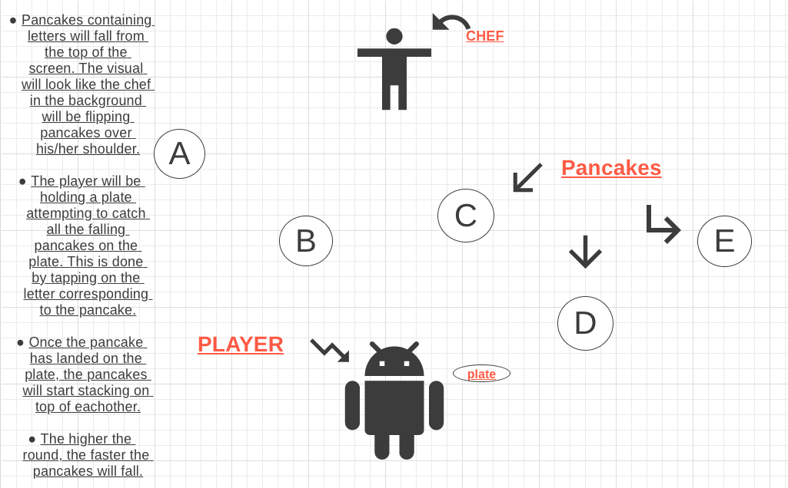

# Project Pancakes

Project Pancakes is an online game that will not only help you improve your typing skill, but keep you entertained for hours. You play as a sous chef trying to keep up with the high pace pancake throwing of your head breakfast chef. As pancakes get thrown at you front the head chef, simply tap on the corresponding key on your keyboard to catch the pancake on the plate. But be careful, as the restaurant gets busier, the pancakes will get faster. How many hungry customers can you feed? 

___

## MVPs
* Board (Day 1)
  -User will be able to see a background with a playable character and background animation

* Game Logic (Day 2 & 3)
  - User will be able to tap on key to move player in order to catch falling pancake.

* HighScore (Day 4)
  - User will be able to keep highscore in order to record their progress.

* Animation (Day 5)
  - User will be able to see pancakes fall frame by frame, and player move side to side. 

___

## Technologies

* Canvas
  - Canvas is an HTML element that will allow me to draw grapics on the page and will assist in obtaining user input for eventListeners
___

## Wireframe

