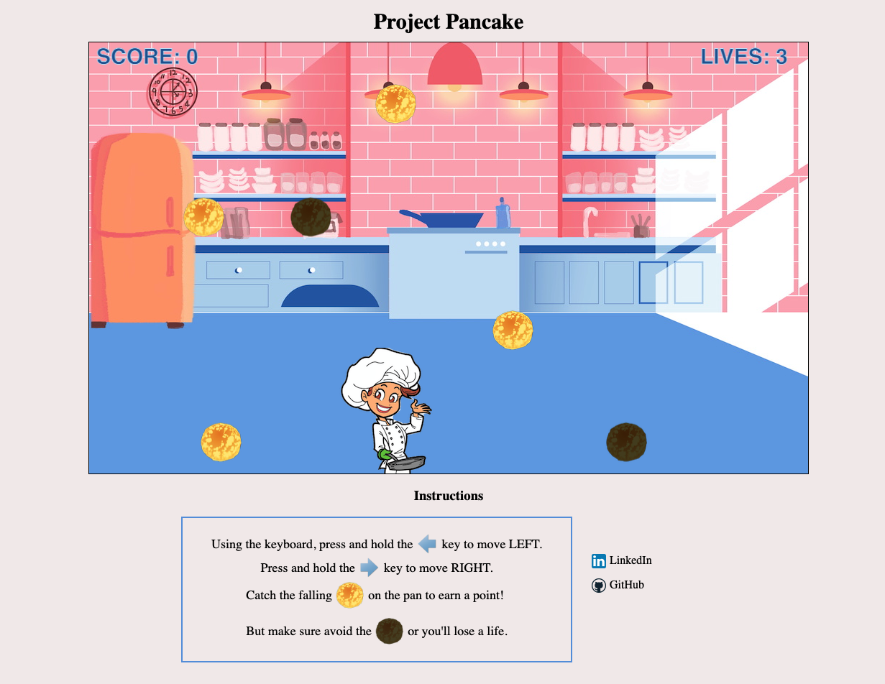
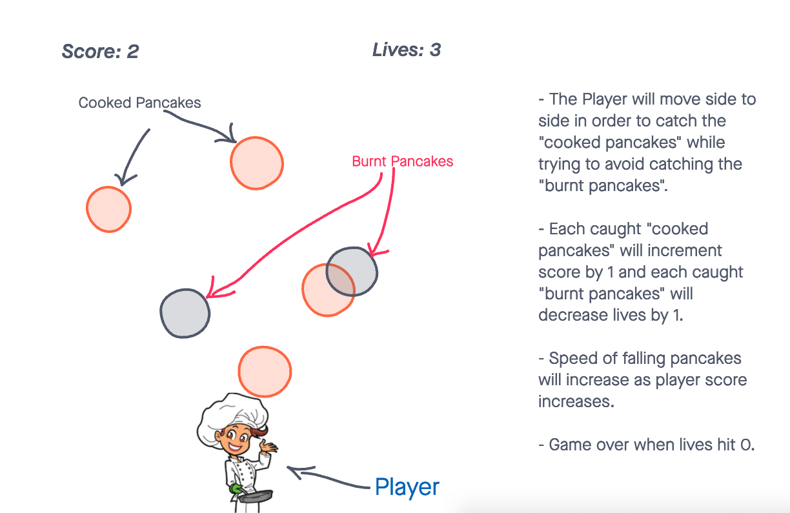

# Project Pancakes

[Live Link](https://stevensuazo.github.io/Project-Pancake/)
Project Pancakes is an online game computer game. You play as a sous chef trying to keep up with the high pace pancake throwing of your head breakfast chef. As pancakes get thrown at you, simply press and hold the arrow keys to move the player and catch the pancake on the pan. But be careful not to catch the burnt pancakes, as the restaurant gets busier, the pancakes will get faster. How many hungry customers can you feed? 

___

## MVPs
* Board (Day 1)
  - User will be able to see a background with a playable character and background animation

* Animation (Day 2)
  - User will be able to see pancakes fall, and player move side to side. 

* Game Logic (Day 3 & 4)
  - User will be able to tap on key to move player in order to catch falling pancake.

* HighScore (Day 5)
  - User will be able to keep highscore in order to record their progress.

___

## Technologies

* Canvas
  - Canvas is an HTML element that will allow me to draw grapics on the page and will assist in obtaining user input for eventListeners
___

## Wireframe

